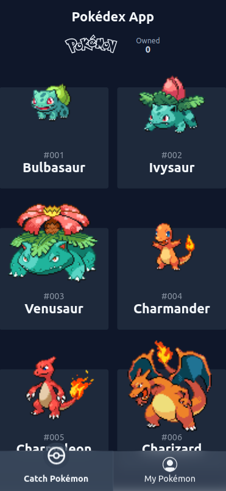
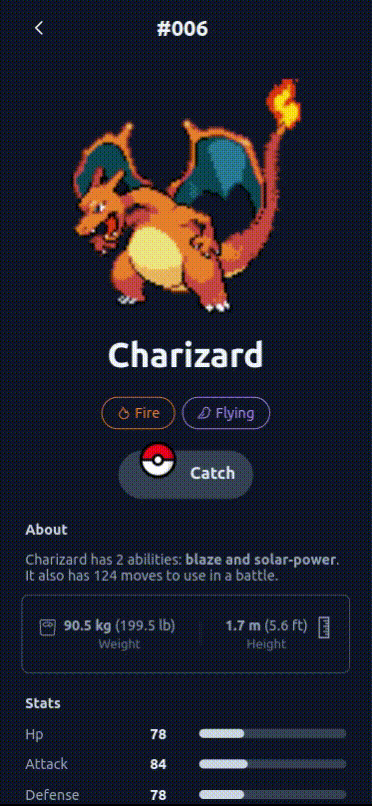

# Pokédex - A Gamify Pokemon Catalog App

<p float="left">
  
   
</p>

## Run Locally

### Prerequisite

- [Node.js](https://nodejs.org/)

Clone the project

```bash
git clone https://github.com/ivqonsanada/pokedex-app.git
```

Go to the project directory

```bash
cd pokedex-app
```

Install dependencies

```bash
npm install 
```

Start the server

```bash
npm start
```

Open http://localhost:3000 with your browser to see the result.

## Running test

To run test
```bash
npm test
```

To see code coverage
```bash
npm test -- --coverage
```

## Built With

- [Create React App](https://create-react-app.dev/) to initialize the project.
- [Emotion](https://emotion.sh/) to manipulate css in js.
- [Apollo](https://www.apollographql.com/docs/react/get-started/) to be a graphql client.
- [mazipan/graphql-pokeapi](https://github.com/mazipan/graphql-pokeapi) to provide pokedex data.
- [Workbox](https://developers.google.com/web/tools/workbox/modules/workbox-strategies) to create service worker easily and painlessly.
- [Statically.io](https://statically.io/) to serve pokemons assets on faster CDN with the help of [static-zap](https://www.npmjs.com/package/convert-staticzap).
- [Jest](https://jestjs.io/) & [Testing Library](https://testing-library.com/) to test the app.
- [TypeScript](https://typescriptlang.org) to help find typos and incorrect types.
- [CircleCI](circleci.com) to test the app quickly
- [Vercel](https://vercel.com/) to deploy and monitor the app lighthouse performance scoring with [Cheekly](https://www.checklyhq.com/) effortlessly.